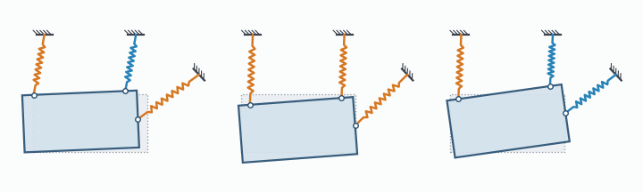
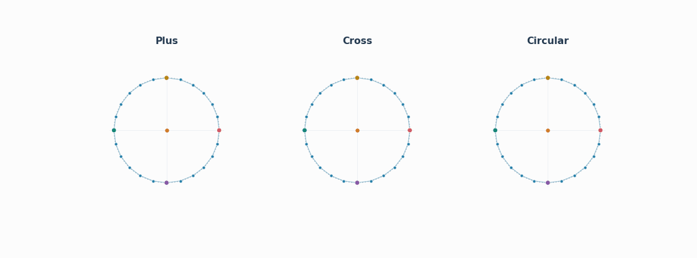
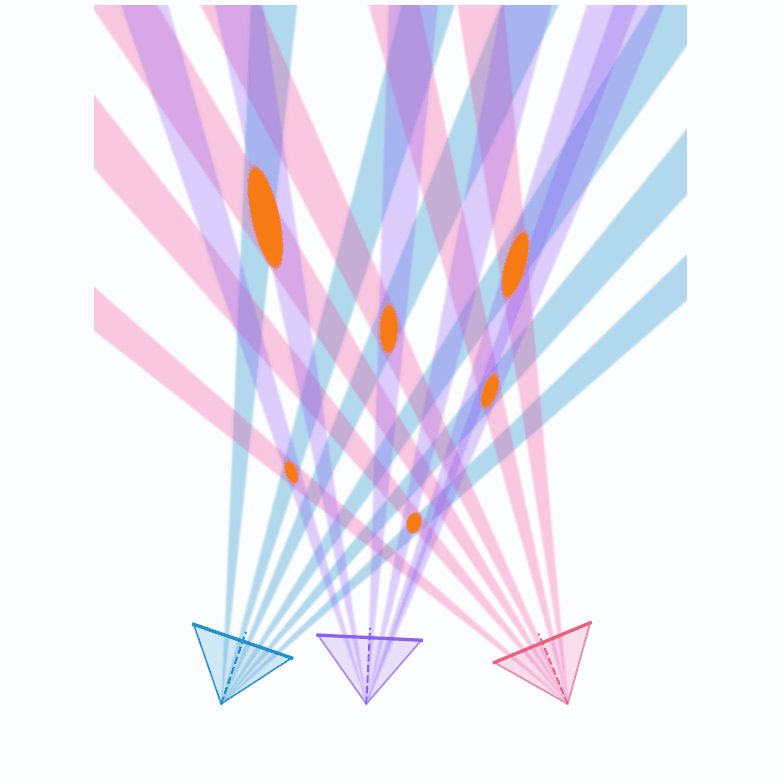

# numga

Geometric algebra with Extensors in NumPy, JAX and PyTorch.

| [**Spring modes**](examples/mechanics/modes/) [](https://colab.research.google.com/github/EelcoHoogendoorn/numga/blob/main/examples/mechanics/modes/modes.ipynb) | [**Gravitational waves**](examples/relativity/curvature/) [](https://colab.research.google.com/github/EelcoHoogendoorn/numga/blob/main/examples/relativity/curvature/curvature.ipynb) |
| :---: | :---: |
|  |  |
| [**Multiview reconstruction**](examples/geometry/multiview/) [](https://colab.research.google.com/github/EelcoHoogendoorn/numga/blob/main/examples/geometry/multiview/multiview_reconstruction.ipynb) | [**Spherical quadrics**](examples/quadrics/elliptic_physics/) [](https://colab.research.google.com/github/EelcoHoogendoorn/numga/blob/main/examples/quadrics/elliptic_physics/s2_physics.ipynb) |
|  |  |

* [extensors](docs/extensors.md): An introduction to extensors in numga
* [examples](examples/README.md): An index of runnable example code.

A short example of the extensor syntax: building unary maps and bilinear forms, transforming an extensor, and solving a problem, the vibration modes of four point masses on springs:

```python
from numga import JaxContext
from numga.algebras import PGA3D

mv = JaxContext(PGA3D).multivector
Bivector = PGA3D.gatype.bivector()

points = mv.vector([[0, 0, 0, 1], [1, 0, 0, 1], [0, 1, 0, 1], [0, 0, 1, 1]]).dual()   # four unit masses
inertia = (points & points.commutator(Bivector)).sum(axis=0)   # Antibivector <- Bivector

motor = (mv.xy * 0.3 + mv.zw * 0.2).exp()                      # rotation plus translation
world_inertia = motor >> inertia(motor << Bivector)            # move the body

springs = points[[0, 0, 0, 1, 1, 2]] & points[[1, 2, 3, 2, 3, 3]]   # Antibivector
stiffness = (springs * (springs & Bivector)).sum(axis=0)   # Antibivector <- Bivector
# the vibration modes, between two bilinear energy forms
values, modes = (Bivector & stiffness).eigh(Bivector & inertia)
```

## Install and run

```sh
python -m pip install -e ".[linalg,examples]"     # add ".[jax]" or ".[torch]" for those backends
python -m examples.mechanics.modes.scenarios --animate
```
