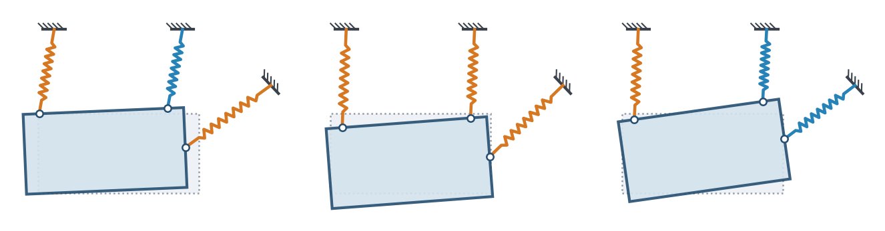
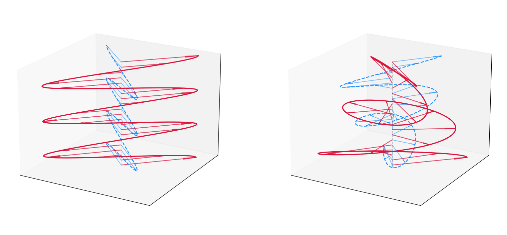
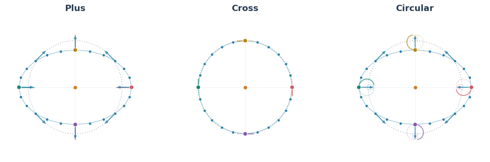
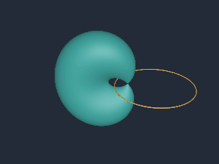

# Definition

In mathematical terms, an extensor is a multi-linear map from multivectors to a multivector.

In programming terms, extensors allow one to leave open arguments to an expression, and bind them at a later time. A batch axis is not an open argument: it indexes independent copies of an expression.

When doing mathematics on the blackboard, one often switches between expressions involving a specific vector, or expressions over the entire space of vectors. Extensor syntax brings that same flexibility to geometric algebra in code, combining expressivity with efficiency of the underlying code.

The term extensor was coined by Hestenes [[ca-to-gc](#ref-ca-to-gc)]. He defines an extensor as any multilinear function of multivector arguments, and notes that tensors, the multilinear functions of vectors, are the special case. Not every block of numbers of the right shape is one, any more than every block of numbers is a tensor. Numga's extensors are built from the products of the algebra, so they transform as the geometry they are built from does. Nothing in the definition mentions a separate metric tensor: the metric is part of the algebra.

# Motivation

Geometric relationships deserve to be first-class objects alongside the objects they relate. Inertia, stiffness, and material responses are maps that we need to construct, combine, transform, and solve with. Extensors make those relationships part of the geometric algebra library, expressed through the same operations as the geometry that defines them.

Extensors bridge geometric algebra with conventional linear algebra. The examples below use the full spectrum of linear maps: rotor sandwiches and outermorphisms alongside non-orthogonal transformations, polarities, and derivations. Extensors subsume all of them, matrices included, into the algebra itself: any linear map between blade subspaces becomes a typed, coordinate-free object. Solvers, spectral decompositions, and least-squares optimizations can be performed directly on geometric relationships, returning geometrically typed results.

The same holds against tensor algebra. In tensor terms, an extensor is a tensor whose slots are typed by blade subspaces rather than by index placement. The metric lives in the products of the algebra, so there is no distinction between upper and lower indices to carry through a calculation. A map and a form differ only in whether the inner product has been applied, and that application is written explicitly, once, as an open inner-product slot. Higher rank comes from open slots, not from a tensor product. Index gymnastics become slot bookkeeping, and the types do the bookkeeping.

# Companion documents

* [`extensor_syntax.md`](extensor_syntax.md): the syntax and the extension methods, as a reference sheet.
* [`extensor_advanced.md`](extensor_advanced.md): maps against forms, the pairing that replaces the transpose, traces, norms and gauges.
* [`internals.md`](internals.md): what the library builds from an expression, and what runs when values are supplied.

# Examples

Capitalized names are multivector spaces and lower case names are concrete multivectors: `v ^ V` is the wedge product of a specific vector with the space of all vectors, an extensor with bivector output and one open argument.

### Index
1. [**Computer Graphics & Optics (PGA3D)**](#1-scenegraph-forward-kinematics--camera-optics-pga3d): Collapsing affine scales, joint motors, compound lenses, and sensor projection into a single evaluated extensor.
2. [**Mechanics & Vibrations (PGA2D)**](#2-rigid-body-normal-modes--vibration-pga2d): Additive stiffness and inertia extensors without coordinate origins, generalized eigensolves on energy bilinear forms.
3. [**Multi-View Vision & Camera Alignment (PGA2D)**](#3-multi-view-scene-reconstruction--camera-alignment-pga2d): Lifting 1D pixels into directional quadric cones, additive multi-view fusion, closed-form triangulation, and Lie algebra pose Jacobians.
4. [**Electromagnetism & Spacetime Physics (STA)**](#4-spacetime-constitutive-relations-dispersion--relativistic-fresnel-drag-sta): Observer decompositions, lifting 3D material quadrics to 6D spacetime extensors, and detecting wave dispersion and polarizations via SVD.
5. [**Gravitational Waves & Tidal Forces (STA)**](#5-gravitational-wave-curvature--tidal-forces-sta): Curvature as a nilpotent map on bivectors, the Ricci form as a trace, and observers bound into tidal maps.
6. [**Rigid Bodies on the Sphere (Spherical3D)**](#6-rigid-bodies-on-the-sphere-spherical3d): Implicit rendering, collision as the margin of a blend of forms, and impulses through inertia maps.
7. [**Dupin Cyclides & Vortices on the 3-Sphere (Conformal Model)**](#7-dupin-cyclides--vortices-on-the-3-sphere-conformal-model): The ray polynomial as open forms, dilations into Dupin cyclides, and vortex flows.

---

## 1. Scenegraph, Forward Kinematics & Camera Optics (PGA3D)

**Notebook**: [`examples/geometry/scenegraph/scenegraph.ipynb`](../examples/geometry/scenegraph/scenegraph.ipynb)


#### Construction
```python
# Non-uniform scale, joint motors, compound optics, and viewport collapse into one extensor:
body = pose >> make_anisotropic_scale(sx, sy, sz)                     # [] Point <- Point
camera = to_sensor(rear_lens(front_lens(ray_constructor)))            # [] Point <- Point
local_to_pixel = viewport(camera(camera_pose << body))                # [5] Point <- Point

# Evaluates directly as a compiled linear map over geometry:
pixels = local_to_pixel[:, None](unit_box[None, :])                   # [5, 8] Point
```

#### Key Takeaways
* **Full Pipeline Collapse**: Non-uniform scaling (affine), articulated joint motors (rigid), compound lenses (refractive), and sensor projection (perspective) compose into a single batched extensor (`Point <- Point`) *before* touching geometry.
* **Compiled Linear Execution**: Under the hood, the default dense backend contracts intermediate spaces akin to broadcasted matrix products. This is an implementation detail—sparse and symbolic execution follow the exact same extensor semantics—while matching classical graphics performance natively within GA.

---

## 2. Rigid-Body Normal Modes & Vibration (PGA2D)

**Notebook**: [`examples/mechanics/modes/modes.ipynb`](../examples/mechanics/modes/modes.ipynb)



#### Construction
```python
# Measure spring stretch from an open twist, assemble stiffness and inertia, eigensolve:
extension = Twist & lines                                              # [n_springs] Scalar <- Twist
stiffness = (lines * extension * spring_constants).sum()               # [] Wrench <- Twist
inertia = (mass_points & mass_points.commutator(Twist) * masses).sum()  # [] Wrench <- Twist

# Symmetric bilinear energy forms dispatch to generalized Hermitian eigensolve:
values, modes = (Twist & stiffness).eigh(Twist & inertia)              # values: [3] Scalar, modes: [3] Twist
frequencies = values.clip(0, np.inf).square_root() / (2 * np.pi)       # [3] Scalar (Hz)
```

#### Key Takeaways
* **Additive Physical Responses**: Springs are rank-1 dyads (`Wrench <- Twist`) and mass points are momentum lines (`Wrench <- Twist`). Summing individual extensors synthesizes total stiffness and inertia without selecting coordinate origins or applying Steiner's parallel-axis shifts.
* **Energy Bilinear Forms & Eigensolve**: Contracting with open twists yields symmetric bilinear forms (`Scalar <- (Twist, Twist)`), allowing a direct generalized eigensolve `pe_form.eigh(ke_form)` without inverting inertia or forming asymmetric coordinate matrices $M^{-1}K$.

---

## 3. Multi-View Scene Reconstruction & Camera Alignment (PGA2D)

**Notebook**: [`examples/geometry/multiview/multiview_reconstruction.ipynb`](../examples/geometry/multiview/multiview_reconstruction.ipynb)


#### Construction
```python
# Carry sensor discs back through the camera into sight cones, fuse across cameras, triangulate:
on_lines = (Plane & Point).solve(Plane & projection)                   # [] Plane <- Plane, induced by the camera
cones = on_lines(sensor_discs(projection))                             # [n_pts, n_cams] Plane <- Point
splats = (poses >> cones(poses << Point)).sum(axis=-1)                 # [n_pts] Plane <- Point
points = (splats + w * (w & Point)).solve(w).normalized()              # [n_pts] Point

# Newton on the cone value: a local point's motion under a camera twist, joined with its own polar:
motion = -Twist.commutator(poses << points[:, None])                   # [n_pts, n_cams] Point <- Twist
curvature, gradient = (cones(motion) & motion).sum(axis=0), (cones(poses << points[:, None]) & motion).sum(axis=0)
step = curvature.solve(-gradient)                                      # [n_cams] Twist
```

#### Key Takeaways
* **Lifting Precision into Sight Cones**: A pixel's precision disc is a polarity map on sensor points. The map on lines induced by the camera, solved from the incidence pairing, carries its polar lines back through the singular projection into a perspective cone whose uncertainty widens with depth. No transpose is written.
* **Additive Fusion & Closed-Form Triangulation**: Multi-view constraints combine by direct addition (`world_cones.sum(axis=-1)`). A fused cone's polar of its vertex vanishes; a gauge dyad on the weight makes that vertex the pole of the line at infinity, `splats.solve(w)`, without ray-intersection heuristics.
* **Newton on the Quadric**: The motion of a local point under an open twist (`-Twist.commutator(...)`), joined with its own polar, is the curvature over poses; joined with the point's polar it is the gradient. The cone is the cost, so no residual metric is chosen, and the curvature form is the information on the pose.

---

## 4. Spacetime Constitutive Relations, Dispersion & Relativistic Fresnel Drag (STA)

**Notebook**: [`examples/electromagnetism/constitutive/constitutive.ipynb`](../examples/electromagnetism/constitutive/constitutive.ipynb)



#### Construction
```python
# Split 6D bivectors via observer, lift 3D material quadric, and boost via Lorentz sandwich:
electric = Bivector.commutator(t).wedge(t)                             # [] Bivector <- Bivector
crystal = permittivity(Bivector.commutator(t)).wedge(t) + magnetic / mu
moving_crystal = boost >> crystal(boost << Bivector)                   # [n_betas] Bivector <- Bivector

# Detect physical plane waves where Maxwell wave map drops rank:
wave = k.commutator(moving_crystal(k.wedge(Spatial)))                  # [n_speeds] Vector <- Spatial
v_phase = speeds[wave.svdvals()[..., -1].argmin(axis=0)]
```

#### Key Takeaways
* **Observer Decomposition & Quadric Lifting**: An observer's timelike 4-velocity $t$ decomposes 6D field bivectors into 3D electric and magnetic vectors. Spatial material relations lift into 6D bivector extensors without coordinates.
* **Dispersion & Polarizations via SVD**: Maxwell's equations in media compile into a single linear map $W_k$; physical propagating phase speeds and transverse polarizations emerge directly from SVD nullspaces.

---

## 5. Gravitational Wave Curvature & Tidal Forces (STA)

**Notebook**: [`examples/relativity/curvature/curvature.ipynb`](../examples/relativity/curvature/curvature.ipynb)



#### Construction
```python
# Curvature from null dyads with the area open; cross is plus turned by an eighth-turn rotor:
nx, ny = k.wedge(x), k.wedge(y)                                        # [] Bivector (null planes)
plus = nx * (nx | Bivector) - ny * (ny | Bivector)                     # [] Bivector <- Bivector
cross = eighth_turn >> plus(eighth_turn << Bivector)                   # [] Bivector <- Bivector

ricci = Vector.commutator(plus(Vector.wedge(Vector))).trace(slot=1)    # [] Scalar <- (Vector, Vector): zero in vacuum
tidal = plus(t.wedge(Vector)).commutator(t)                            # [] Vector <- Vector: what observer t measures
```

#### Key Takeaways
* **Nilpotent but not zero**: the vacuum curvature's image lies in its own kernel, so all its eigenvalues vanish; Ricci-flatness is a one-line trace.
* **Observers are bound, not conjugated**: binding `t` gives a tidal map with eigenvalues ±A, the stretch and squeeze of the bead ring.

---

## 6. Rigid Bodies on the Sphere (Spherical3D)

**Notebook**: [`examples/quadrics/elliptic_physics/s2_physics.ipynb`](../examples/quadrics/elliptic_physics/s2_physics.ipynb)


#### Construction
```python
inside = (pixels & form(pixels)) < 0.0                                     # the implicit render: one test per pixel
margin, deepest = core.overlap(bodies.C[a], relative >> bodies.C[b](relative << Point))   # the best blend's least eigenvalue
impulse = -2.0 * closing / (one.regressive(response_one) + other.regressive(response_other))   # through the inverse inertia
```

#### Key Takeaways
* **Shapes are forms**: an ellipse is a sum of point dyads, drawn by evaluating it at every pixel, and two ellipses are apart exactly when a blend of their forms is positive definite.
* **Inertia is a map**: `Momentum <- Rate` from mass points; impulses go through its inverse, and the crowd keeps its energy and momentum.

---

## 7. Dupin Cyclides & Vortices on the 3-Sphere (Conformal Model)

**Notebook**: [`examples/geometry/cyclides/cyclides.ipynb`](../examples/geometry/cyclides/cyclides.ipynb)



#### Construction
```python
form = Point & surfaces                                                    # [n] Scalar <- (Point, Point): zero on the surface
# The ray X = origin + 2u ray_linear(d) + u² ray_bend(d, d) in form(X, X), one form per power of u:
constant = form(origin, origin)                                            # [n] Scalar
linear = 4 * form(origin, ray_linear)                                      # [n] Scalar <- Direction
quadratic = 4 * form(ray_linear, ray_linear) + 2 * form(origin, ray_bend)  # [n] Scalar <- (Direction, Direction)
cubic = 4 * form(ray_linear, ray_bend)                                     # [n] Scalar <- (Direction,) * 3
quartic = form(ray_bend, ray_bend)                                         # [n] Scalar <- (Direction,) * 4
```

#### Key Takeaways
* **The ray polynomial is a set of forms**: its coefficients keep the pixel direction open, so one binding gives every pixel's quartic.
* **Conformal maps make the shapes**: dilations bend tubes into tori and Dupin cyclides, and a circle's exponential carries a surface around it.

# References

* <a id="ref-ca-to-gc"></a>**[ca-to-gc]** D. Hestenes and G. Sobczyk, *Clifford Algebra to Geometric Calculus: A Unified Language for Mathematics and Physics*. [Link](https://www.researchgate.net/publication/258944244_Clifford_Algebra_to_Geometric_Calculus_A_Unified_Language_for_Mathematics_and_Physics)
