# Definition

In mathematical terms, an extensor is a multi-linear map from multivectors to a multivector.

In programming terms, extensors allow one to leave open arguments to an expression, and bind them at a later time.

When doing mathematics on the blackboard, one often switches between expressions involving a specific vector, or expressions over the entire space of vectors. Extensor syntax brings that same flexibility to geometric algebra in code, combining expressivity with efficiency of the underlying code.

This is the definition of Hestenes and Sobczyk [[ca-to-gc](#ref-ca-to-gc)], for whom extensors are what tensors become when their arguments are multivectors instead of vectors. Numga's extensors are built from the products of the algebra, so they transform as the geometry they are built from does.

# Motivation

Geometric relationships deserve to be first-class objects alongside the objects they relate. Inertia, stiffness, and material responses are maps that we need to construct, combine, transform, and solve with. Extensors make those relationships part of the geometric algebra library, expressed through the same operations as the geometry that defines them.

For readers coming from linear algebra: wherever a geometric computation would use a matrix, numga has an extensor that knows what it maps from and to. The examples below use rotor sandwiches, non-uniform scalings, lenses and projections, and they all compose, invert and apply the same way. Solving, eigen- and singular-value decompositions and least squares work on them directly and return geometry: the vibration modes of example 2 come out as twists, not as columns of numbers.

For readers coming from tensor algebra: where a tensor labels its slots by upper and lower index positions, an extensor labels them by the kind of multivector they take. The metric is part of the algebra's products, so there is nothing to raise or lower. Turning a map into a form means applying the inner product, and you write that once, as an open slot. More slots come from leaving more arguments open, not from tensor products. Index gymnastics become slot bookkeeping, and the types do the bookkeeping.

# Companion documents

* [`extensor_syntax.md`](extensor_syntax.md): the syntax and the extension methods, as a reference sheet.
* [`extensor_advanced.md`](extensor_advanced.md): maps against forms, pullbacks and pairings, traces, norms and gauges.
* [`internals.md`](internals.md): what the library builds from an expression, and what runs when values are supplied.

# Examples

Capitalized names are multivector spaces and lower case names are concrete multivectors: `v ^ V` is the wedge product of a specific vector with the space of all vectors, an extensor with bivector output and one open argument.

### Index
1. [**Computer Graphics & Optics (PGA3D)**](#1-scenegraph-forward-kinematics--camera-optics-pga3d): a robot arm, two lenses and a sensor, composed into one map from each part to the screen.
2. [**Mechanics & Vibrations (PGA2D)**](#2-rigid-body-normal-modes--vibration-pga2d): stiffness and inertia as sums of maps, and vibration modes that come out as motions.
3. [**Multi-View Vision & Camera Alignment (PGA2D)**](#3-multi-view-scene-reconstruction--camera-alignment-pga2d): pixel uncertainty carried back into cones of sight, fused by addition, and cameras aligned by solving with them.
4. [**Electromagnetism & Spacetime Physics (STA)**](#4-spacetime-constitutive-relations-dispersion--relativistic-fresnel-drag-sta): materials as maps on fields, moved at relativistic speeds, and wave speeds from an SVD.
5. [**Gravitational Waves & Tidal Forces (STA)**](#5-gravitational-wave-curvature--tidal-forces-sta): a gravitational wave's curvature as a map on planes, and the tides an observer feels.
6. [**Rigid Bodies on the Sphere (Spherical3D)**](#6-rigid-bodies-on-the-sphere-spherical3d): shapes as quadric forms, drawn, collided and bounced.
7. [**Dupin Cyclides & Vortices on the 3-Sphere (Conformal Model)**](#7-dupin-cyclides--vortices-on-the-3-sphere-conformal-model): ray tracing with open forms, and shapes made by moving maps.
8. [**Magnetic Resonance & Spin Echoes (VGA3D)**](#8-magnetic-resonance--spin-echoes-vga3d): relaxation written as its formula, and a whole pulse sequence composed into one map.
9. [**The Hopf Fibration (VGA3D)**](#9-the-hopf-fibration-vga3d): a spinor's direction as a form with two spinor slots, and the spinors pointing one way as an eigenspace.
10. [**Odometry (PGA2D)**](#10-odometry-the-most-likely-trajectory-pga2d): uncertainties as quadrics on twists, carried along the lap, and the information applied reading by reading, never assembled.
11. [**Edge States of a Graphene Flake (VGA3D)**](#11-edge-states-of-a-graphene-flake-vga3d): a Hamiltonian coupling atoms through multivectors, and spin conservation read off its type.
12. [**Flexible Bodies, Rigidly Joined (PGA2D)**](#12-flexible-bodies-rigidly-joined-pga2d): point constraints between flexible bodies as one sparse map, its adjugate carrying the forces back, and a beam buckling at its Euler load.

---

## 1. Scenegraph, Forward Kinematics & Camera Optics (PGA3D)

**Notebook**: [`examples/geometry/scenegraph/scenegraph.ipynb`](../examples/geometry/scenegraph/scenegraph.ipynb)

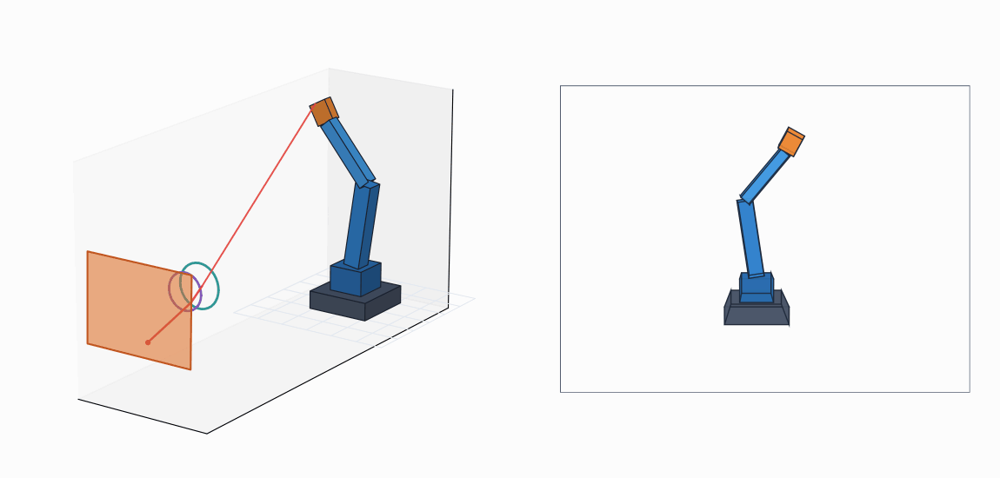

```python
lens = Line - (center & (Line ^ plane)) / focal_length        # [] Line <- Line: a thin lens
rear_lens = rear_placement >> lens(rear_placement << Line)     # [] Line <- Line: the lens, moved down the axis
camera = to_sensor(rear_lens(front_lens(Point & pupil)))       # [] Point <- Point: point to ray to sensor
world_to_pixel = viewport(camera(camera_pose << Point))        # [] Point <- Point
local_to_pixel = world_to_pixel(bodies_to_world)               # [bodies] Point <- Point
```

* **A lens is its formula with the ray left open.** A thin lens bends each line toward its centre by how the line meets the lens plane; written with `Line` open, that expression is the lens.
* **Motors move maps as they move points.** The rear lens is the front lens's formula carried down the axis by a motor, the same way a motor carries a point.
* **One map from part to pixel.** Calling a map on a map composes them: stretching, placement, refraction and perspective become a single `Point <- Point` per part before any vertex is touched.

  In a graphics pipeline it reads as the product of the model, view and projection matrices.

---

## 2. Rigid-Body Normal Modes & Vibration (PGA2D)

**Notebook**: [`examples/mechanics/modes/modes.ipynb`](../examples/mechanics/modes/modes.ipynb)

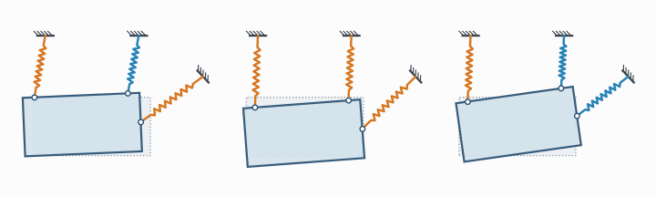

```python
extension = Twist & lines                                        # [springs] Scalar <- Twist: each spring's stretch
stiffness = (lines * extension * spring_constants).sum(axis=0)   # [] Forque <- Twist
velocities = mass_points.commutator(Twist)                       # [mass_points] Point <- Twist
inertia = ((mass_points & velocities) * masses).sum(axis=0)      # [] Forque <- Twist
values, modes = (Twist & stiffness).eigh(Twist & inertia)        # [modes] Scalar, [modes] Twist
```

* **Stiffness and inertia are sums.** A spring is the line it pulls along, and joined with an open twist it reads how far any small motion stretches it. A point's velocity under an open twist is one commutator. Each spring and each mass point adds one term, with no origin chosen and no parallel-axis shift.
* **The modes are motions.** Paired with a second open twist, the two maps are the two energy forms, and solving one against the other returns twists: the motions the body vibrates in.

---

## 3. Multi-View Scene Reconstruction & Camera Alignment (PGA2D)

**Notebook**: [`examples/estimation/multiview/multiview_reconstruction.ipynb`](../examples/estimation/multiview/multiview_reconstruction.ipynb)

<p align="center">
  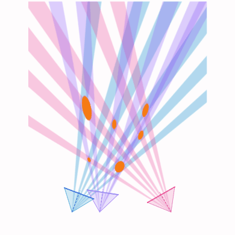
</p>

```python
cones = projection.adjugate()(sensor_discs(projection))   # [points, cams] Plane <- Point: sight cones
splats = (poses >> cones(poses << Point)).sum(axis=-1)    # [points] Plane <- Point
points = (splats + w * (w & Point)).solve(w)              # [points] Point
motion = -Twist.commutator(local_points)                  # [points, cams] Point <- Twist
curvature = (cones(motion) & motion).sum(axis=0)          # [cams] Scalar <- (Twist, Twist)
gradient = (cones(local_points) & motion).sum(axis=0)     # [cams] Scalar <- Twist
```

* **The adjugate carries a pixel's uncertainty into the scene.** The camera has no inverse, but its adjugate keeps incidence, `projection.adjugate()(l) & p == l & projection(p)`, and turns a cost disc around a pixel into a cone of sight that widens with depth.
* **Combining views is addition.** The cones, moved to the world like any map, sum into a splat around each scene point, and one solve finds its centre.
* **Camera alignment in pure geometry.** How a point moves under an open camera step is one commutator. Used on both sides of the cones it gives the curvature, with the point on one side the gradient, and one solve gives the step.

---

## 4. Spacetime Constitutive Relations, Dispersion & Relativistic Fresnel Drag (STA)

**Notebook**: [`examples/electromagnetism/constitutive/constitutive.ipynb`](../examples/electromagnetism/constitutive/constitutive.ipynb)

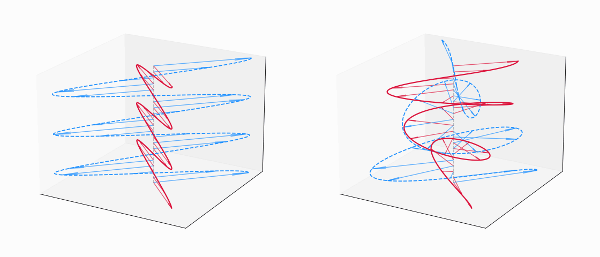

```python
electric = (Bivector - (t >> Bivector)) / 2                    # [] Bivector <- Bivector: what observer t calls electric
glass = (eps * electric + (Bivector - electric) / mu).dual()   # [] Antibivector <- Bivector
moving = boost >> glass(boost << Bivector)                     # [betas] Antibivector <- Bivector: the glass, moving
wave = (k ^ Bivector) + (k ^ moving).dual()                    # [speeds, betas] Odd <- Bivector
wave.svdvals()                                                 # near zero where light can travel
```

* **An observer splits a field with a sandwich.** The observer's time direction flips the planes it calls electric and keeps the magnetic ones, so half the difference with the open field is the electric part. Glass weights the two parts: a map from field to excitation.
* **Moving a material moves a map.** A boost moves the glass the same way it moves a vector. Fresnel drag follows, without transformation rules for the permittivity and permeability.
* **Wave speeds from an SVD.** With the field left open, both of Maxwell's equations for a trial wave become one map. Its smallest singular value vanishes at the speeds light can travel at, and its singular field is the polarization.

---

## 5. Gravitational Wave Curvature & Tidal Forces (STA)

**Notebook**: [`examples/relativity/curvature/curvature.ipynb`](../examples/relativity/curvature/curvature.ipynb)

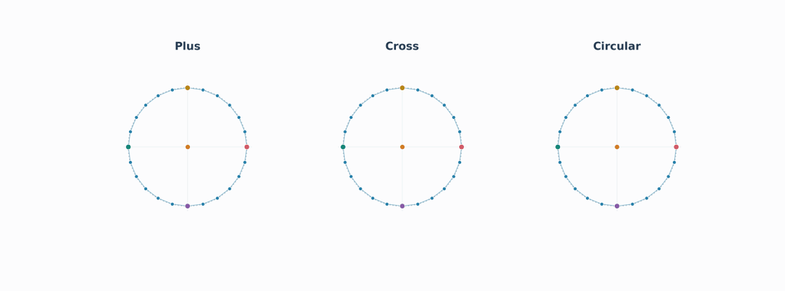

```python
nx, ny = k.wedge(x), k.wedge(y)                                  # [] Bivector: two null planes along the wave
plus = nx * (nx | Bivector) - ny * (ny | Bivector)               # [] Bivector <- Bivector
cross = -I * plus                                                # [] Bivector <- Bivector
riemann = Vector.wedge(Vector) | plus(Vector.wedge(Vector))      # [] Scalar <- (Vector, Vector, Vector, Vector)
ricci = riemann.contract(1, 3)                                   # [] Scalar <- (Vector, Vector): zero
tidal = plus(t.wedge(Vector)).commutator(t)                      # [] Vector <- Vector
```

* **Curvature is a map on planes.** A gravitational wave's curvature is two dyads of null planes along the wave: nonzero, yet applied twice it gives zero. Multiplied by the pseudoscalar, its pattern turns an eighth turn about the wave, and that is the second polarization.
* **Vacuum is a contraction.** With all four vectors open the curvature is a form, and contracting its first and third slots leaves the Ricci form, zero on every pair of vectors.
* **What an observer feels is one binding.** The observer's velocity, wedged into the open plane and read back against itself, leaves a map from separation to acceleration: it stretches a ring of beads one way and squeezes it the other.

---

## 6. Rigid Bodies on the Sphere (Spherical3D)

**Notebook**: [`examples/quadrics/elliptic_physics/s2_physics.ipynb`](../examples/quadrics/elliptic_physics/s2_physics.ipynb)


```python
form = placement >> ellipse.solve(placement << Point)   # [] Plane <- Point: the shape, placed
inside = (pixels & form(pixels)) < 0                    # [pixels]: negative inside
blend = Point & (A + B * np.tan(phi))(Point)            # [pairs] Scalar <- (Point, Point): two shapes, blended
contact_plane = form(deepest).normalized()              # [pairs] Plane: the polar of the deepest point
```

* **A shape is a form, moved like a point.** An ellipse is a sum of dyads on its axis points; solved with the point left open it is the form that is negative inside, and a rotor places the whole map. Drawing is one test per pixel.
* **Contact from a blend of two forms.** Two shapes are apart exactly when some blend of their forms is positive everywhere. The best blend's deepest point, through its polar plane, gives the line the bounce acts along.

---

## 7. Dupin Cyclides & Vortices on the 3-Sphere (Conformal Model)

**Notebook**: [`examples/quadrics/cyclides/cyclides.ipynb`](../examples/quadrics/cyclides/cyclides.ipynb)

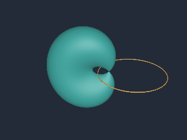

```python
form = Point & surfaces                                  # [surfaces] Scalar <- (Point, Point): zero on the surface
quartic = form(ray_bend, ray_bend)                       # [surfaces] Scalar <- (Direction, Direction, Direction, Direction)
cyclide = inversion >> hyperboloid(inversion << Point)   # [] Sphere <- Point: a hyperboloid, inverted
flow = (circle * (angles / 2)).exp()                     # [frames] Motor: around a circle
carried = flow >> cyclide(flow << Point)                 # [frames] Sphere <- Point
```

* **A form with four open slots.** Feeding the ray's bend into both slots of the surface's form leaves four open directions: the leading coefficient of every pixel's quartic, built before any pixel is seen.
* **Shapes are made by moving maps.** An inversion in a sphere sends both open ends of a hyperboloid to one point, closing them in a conical tip, and a circle's exponential carries the cyclide around that circle.

---

## 8. Magnetic Resonance & Spin Echoes (VGA3D)

**Notebook**: [`examples/quantum/magnetic_resonance/magnetic_resonance.ipynb`](../examples/quantum/magnetic_resonance/magnetic_resonance.ipynb)

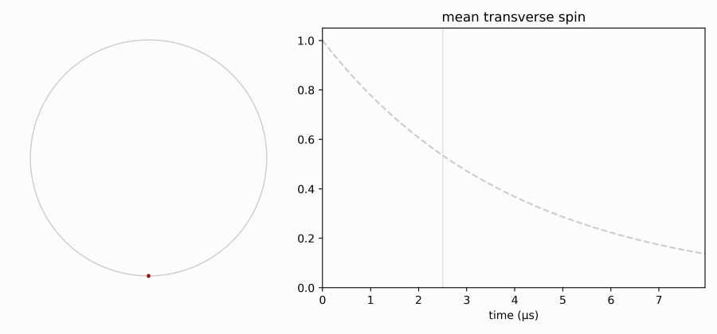

```python
back = process.reverse().symmetric_reverse_product()          # [] State
relaxing = (process >> State) - back.anticommutator(State)    # [] State <- State
twice = span(span)                                            # [spins] State <- State: the same span, twice as long
turn = pulse(np.pi) >> State                                  # [] State <- State
echo = waiting(turn(waiting(tip))).mean(axis=-1)              # [delays] State <- State: tip, wait, turn, wait
```

* **Relaxation is its formula.** The state is left open on both sides of each term: the process's sandwich of the state, less its anticommutator with what the process takes back. No flattened density matrix, no Kronecker products.
* **An experiment is a composition.** A span of evolution composed with itself spans twice the time, a pulse is a sandwich with the state left open, and composed in sequence and averaged over the spins they are one map for the whole sample.

---

## 9. The Hopf Fibration (VGA3D)

**Notebook**: [`examples/math/hopf/hopf.ipynb`](../examples/math/hopf/hopf.ipynb)

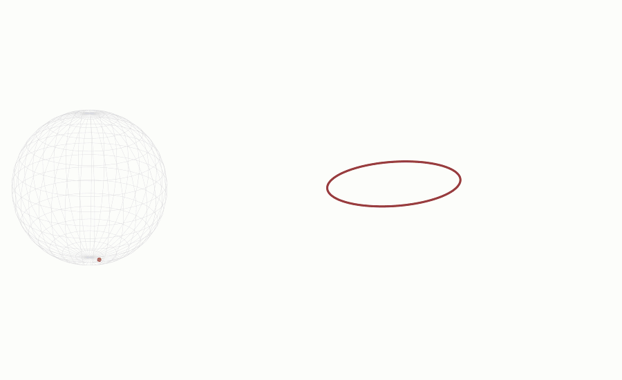

```python
hopf = Even >> mv.z                                   # [] Vector <- (Even, Even): a spinor's direction
_, spinors = (direction | hopf).eigh()                # [..., 4] Even: eigenvalues -1, -1, 1, 1
start = spinors[..., -1]                              # [...] Even
fibre = start[..., None] * (mv.xy * angles).exp()     # [..., angles] Even: every spinor pointing that way
```

* **A sandwich with the spinor open twice.** `Even >> mv.z` leaves the spinor open in both places it appears, so the Hopf map is a form with two spinor slots that returns a vector.
* **A fibre is an eigenspace.** Paired with a direction, the form's top eigenspace holds every spinor pointing that way: a circle in the three-sphere, traced by turning one of them on the right, and linked once with every other.

---

## 10. Odometry: The Most Likely Trajectory (PGA2D)

**Notebook**: [`examples/estimation/odometry/odometry.ipynb`](../examples/estimation/odometry/odometry.ipynb)

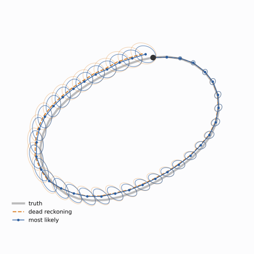

```python
weights = noises.inverse()                                   # [readings] Line <- Twist
summed = (poses >> entering(poses << Line)).cumsum(axis=0)   # [poses] Twist <- Line: carried to the world, added
reckoned = poses << summed(poses >> Line)                    # [poses] Twist <- Line: read back at each pose
at_tails = relative >> weights(relative << Twist)            # [readings] Line <- Twist: a reading's weight, at its tail
```

* **An uncertainty is a quadric on twists.** A covariance maps a line to a twist, `Twist <- Line`, and its inverse weighs a twist error by pairing it with itself.
* **Uncertainties move like maps.** Carried to the world by each pose's motor, the readings' covariances add up along the lap, and read back at each pose they are dead reckoning's growing ellipses.
* **A reading pulls back along the way it measured.** A reading compares its head's twist with its tail's carried to the head, so its weight at the tail is the same weight carried back. Applied reading by reading, the information is never assembled.

---

## 11. Edge States of a Graphene Flake (VGA3D)

**Notebook**: [`examples/quantum/kane_mele/kane_mele.ipynb`](../examples/quantum/kane_mele/kane_mele.ipynb)

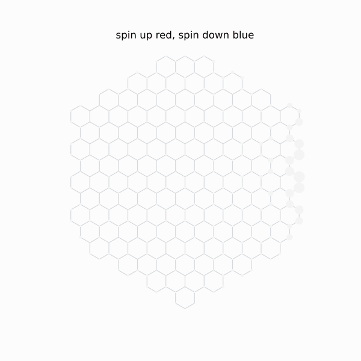

```python
energy = hop + turn * spin_orbit + stagger * mass               # [atoms, atoms]: each coupling 1 or xy
energies, states = (energy * Up).eigh(unit * Up, count)         # [count] Scalar, [count, atoms] Up
turned = weights * (mv.xy * (-energies * time)).exp()           # [states] Even
spin = (states * turned[:, None]).sum(axis=0) >> mv.z           # [atoms] Vector
```

* **Couplings are multivectors.** The Hamiltonian is a sparse extensor between spinor fields over the flake's atoms: neighbours coupled by a scalar, second neighbours by the plane `xy`.
* **Spin conservation is a type.** `energy * Up` leaves a spin-up spinor open, and since every coupling is `1` or `xy` it returns one, so each spin is solved on its own.
* **Time is a turn on the right.** Each state turns on its right at the rate of its energy, and the spin density of their sum is a sandwich.

---

## 12. Flexible Bodies, Rigidly Joined (PGA2D)

**Notebook**: [`examples/mechanics/modal_xpbd/modal_xpbd.ipynb`](../examples/mechanics/modal_xpbd/modal_xpbd.ipynb)

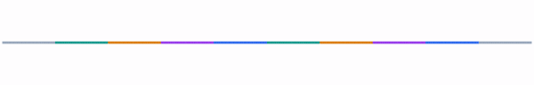

```python
anchor_motion = (motor >> local_anchors.commutator(Twist)) * signs   # [constraints, sides] Direction <- Twist
system = rigid(inverse_inertias(rigid.adjugate())) + compliance      # [constraints, constraints] Direction <- Force
displacement = inverse_inertia(rigid.adjugate()(reactions))          # [bodies] Twist
```

* **An anchor's motion is a commutator.** `anchor.commutator(Twist)` maps a body's twist to how far the anchor moves. Over all constraints and the bodies they join, these maps are the cells of one sparse extensor, `rigid`.
* **The adjugate carries forces back.** `rigid.adjugate()` maps forces at the constraints to forques on the bodies, doing the same work: `rigid.adjugate()(forces) & twists == forces & rigid(twists)`.
* **The system is a composition.** Forces to forques, forques to twists, twists to gaps: `rigid(inverse_inertias(rigid.adjugate()))`, with the compliance of the modes and joints added, is solved once for every reaction, without assembling a Jacobian.

# References

* <a id="ref-ca-to-gc"></a>**[ca-to-gc]** D. Hestenes and G. Sobczyk, *Clifford Algebra to Geometric Calculus: A Unified Language for Mathematics and Physics*, Reidel, 1984. Extensors are defined in Section 3-10, "Tensors"; extensor fields and their differentials in Section 4-1. [Link](https://math.mit.edu/~dunkel/Teach/18.S996_2022S/books/Hestenes-Sobczyk1984_Book_CliffordAlgebraToGeometricCalc.pdf)
