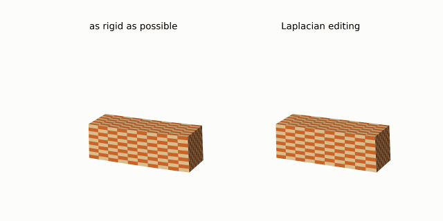
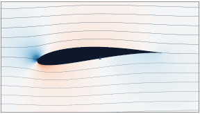
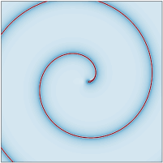
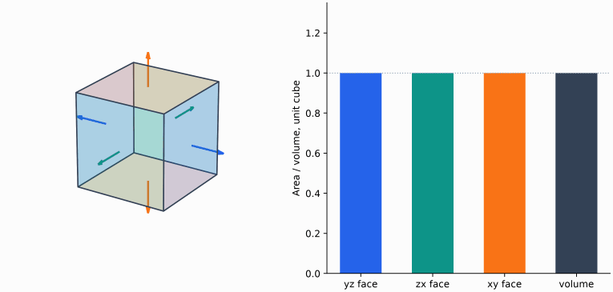
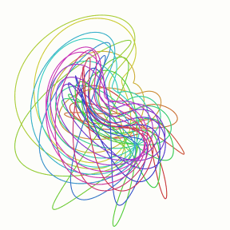

# Definition

An extensor is a multilinear map from multivectors to a multivector: an expression with arguments left open, to be bound later. On the blackboard one moves freely between a specific vector and the space of all vectors; extensors bring that to code. The definition is Hestenes and Sobczyk's [[ca-to-gc](#ref-ca-to-gc)], for whom extensors are what tensors become when their arguments are multivectors. Numga builds them from the algebra's products, so they transform as the geometry they are built from.

# Motivation

Inertia, stiffness and material responses are maps we construct, combine, transform and solve with. Extensors make them first-class, written with the same products as the geometry they relate.

Extensors include matrices and tensors. A matrix is an extensor that takes a vector and returns a vector, and a tensor is an extensor that takes only vectors. Extensors take any kind of multivector, such as a plane, a line or a rotor, and can be built from any product of the algebra.

# Companion documents

* [`extensor_syntax.md`](extensor_syntax.md): the syntax and the extension methods, as a reference sheet.
* [`extensor_advanced.md`](extensor_advanced.md): maps against forms, pullbacks and pairings, traces, norms and gauges.
* [`internals.md`](internals.md): what the library builds from an expression, and what runs when values are supplied.
* [`examples/README.md`](../examples/README.md): the complete index of examples.

# Examples

A selection of examples follows, covering a range of extensor concepts. In the code below, capitalized names stand for whole spaces of multivectors and lower case names for specific ones. So `v ^ V` is a specific vector wedged with every vector: an extensor that takes a vector and returns a bivector.

---

## 1. Scenegraph, Forward Kinematics & Camera Optics (PGA3D)

**Notebook**: [`examples/geometry/scenegraph/scenegraph.ipynb`](../examples/geometry/scenegraph/scenegraph.ipynb)


```python
body = pose >> scale                                           # [] Point <- Point: a unit box, stretched and placed
lens = Line - (center & (Line ^ plane)) / focal_length         # [] Line <- Line: a thin lens
rear_lens = rear_placement >> lens(rear_placement << Line)      # [] Line <- Line: the lens, moved down the axis
camera = to_sensor(rear_lens(front_lens(Point & pupil)))        # [] Point <- Point: point to ray to sensor
local_to_pixel = viewport(camera(camera_pose << Point))(bodies_to_world)   # [bodies] Point <- Point
```

* **Scaling beside motors.** A part is a unit box, stretched by a scaling and placed by a motor: one more map, composed like any other.
* **One map per part, before any vertex.** Calling a map on a map composes them, so each vertex costs one application of one map, as in a matrix pipeline.
* **A lens is its formula with the ray left open,** and a motor carries it down the axis.

---

## 2. Rigid-Body Normal Modes & Vibration (PGA2D)

**Notebook**: [`examples/mechanics/modes/modes.ipynb`](../examples/mechanics/modes/modes.ipynb)


```python
extension = Twist & lines                                        # [springs] Scalar <- Twist: each spring's stretch
stiffness = (lines * extension * spring_constants).sum(axis=0)   # [] Forque <- Twist
velocities = mass_points.commutator(Twist)                       # [mass_points] Point <- Twist
inertia = ((mass_points & velocities) * masses).sum(axis=0)      # [] Forque <- Twist
values, modes = (Twist & stiffness).eigh(Twist & inertia)        # [modes] Scalar, [modes] Twist
```

* **Stiffness and inertia are sums.** One term per spring and per mass point, with no origin chosen and no parallel-axis shift.
* **An eigenproblem on two forms.** `Twist & stiffness` and `Twist & inertia` are the two energies as forms, and `eigh` solves one against the other, returning the modes as twists.

---

## 3. As Rigid As Possible (VGA3D)

**Notebook**: [`examples/surfaces/arap/arap.ipynb`](../examples/surfaces/arap/arap.ipynb)

<p align="center"></p>

```python
forms = ~A10 * H1 * (edges | (Even >> rest))                 # [V] Scalar <- (Even, Even): each vertex's form on a rotor
rotors = forms.eigh()[1][..., -1]                            # [V] Even: every vertex's best rotor
turned = (A10 * (rotors >> Vector))(rest)                    # [E] Vector: each rest edge, turned by its ends' rotors
vertices = held.solve(~T10 * H1 * turned + P * targets)      # [V] Vector
```

* **The best rotor is an eigenvector.** `edges | (Even >> rest)` measures how well an open rotor turns each rest edge onto its edge; summed at each vertex it is a form on rotors, and its top eigenvector is the vertex's best rotor.
* **A rotor becomes a map.** `rotors >> Vector` is each rotor as the turn it makes; averaged over each edge's ends, the turns carry the rest edges, and one sparse solve places the vertices.

---

## 4. Lift without Vorticity (VGA2D)

**Notebook**: [`examples/mechanics/wing/wing.ipynb`](../examples/mechanics/wing/wing.ipynb)

<p align="center">
  
</p>

```python
velocity = stream - radius_squared * (inverse * stream * inverse) - swirl * inverse / (2 * np.pi)   # [rings, angles] Vector
change = -(inverse * Vector * inverse)                                     # [rings, angles] Vector <- Vector
gradient = -radius_squared * (change * stream * inverse + inverse * stream * change) - swirl * change / (2 * np.pi)
derivative = (Vector * gradient(Vector)).contract(1, 2)                    # [rings, angles] Even: zero
carried = (velocity | Vector)(jacobian.solve(1 * Vector))                  # [rings, angles] Scalar <- Vector: at the wing
loops = (velocity * steps).sum(axis=-1)                                    # [rings] Even: circulation, no flux
```

* **Ideal flow is one equation.** The velocity's geometric derivative, its gradient contracted against an open vector, holds its divergence and its vorticity, and vanishes everywhere.
* **Carried by a map that keeps angles.** The potential's gradient, composed with the inverse Jacobian, is the wing's.
* **The lift lives in the loop.** Around every ring, the velocity times each step sums to the circulation, with no flux.

---

## 5. Moving Charges & Maxwell's Equations (STA)

**Notebook**: [`examples/electromagnetism/moving_charge/moving_charge.ipynb`](../examples/electromagnetism/moving_charge/moving_charge.ipynb)

<p align="center">
  
</p>

```python
at_rest = weight * mv.t * (separations | Vector)                    # [charges, ...] Vector <- Vector: each charge's potential gradient, at rest
gradients = charges.boost >> at_rest(charges.boost << Vector)       # [charges, ...] Vector <- Vector: the charge, moving
field = (Vector ^ gradients.sum(axis=-1)(Vector)).contract(1, 2)    # [...] Bivector: the charges' gradients, added
derivative = (Vector * field_gradients(Vector)).contract(1, 2)      # [...] Odd: the current, through the metric
current = (field_gradients(Vector) & Antivector).trace(1, 2)        # [...] Vector: the same current, without one
```

* **The field is never written down.** Each charge's potential gradient is its gradient at rest, moved by its boost; the gradients add, and contracting the sum against an open vector gives the field.
* **Maxwell's equations with and without the metric.** Contracting the field's gradient gives the current through the metric; joining it with an open antivector and tracing gives the same current with no metric at all.

---

## 6. Multi-View Scene Reconstruction & Camera Alignment (PGA2D)

**Notebook**: [`examples/estimation/multiview/multiview_reconstruction.ipynb`](../examples/estimation/multiview/multiview_reconstruction.ipynb)

<p align="center">
  
</p>

```python
cones = projection.adjugate()(sensor_discs(projection))   # [points, cams] Plane <- Point: sight cones
splats = (poses >> cones(poses << Point)).sum(axis=-1)    # [points] Plane <- Point
points = (splats + w * (w & Point)).solve(w)              # [points] Point
motion = -Twist.commutator(local_points)                  # [points, cams] Point <- Twist
curvature = (cones(motion) & motion).sum(axis=0)          # [cams] Scalar <- (Twist, Twist)
gradient = (cones(local_points) & motion).sum(axis=0)     # [cams] Scalar <- Twist
```

* **The adjugate carries a pixel's uncertainty into the scene.** The camera has no inverse, but its adjugate keeps incidence and turns a pixel's cost disc into a cone of sight.
* **Combining views is addition.** The cones, moved to the world, sum into a splat, and one solve finds its centre.
* **The linear algebra is geometry.** How a point moves under an open camera step is one commutator; met by the sight cones on both sides it is the curvature, and with the point on one side the gradient. The Jacobian, the normal matrix and the gradient of a Gauss–Newton step each come out as a geometric object.

---

## 7. Odometry: The Most Likely Trajectory (PGA2D)

**Notebook**: [`examples/estimation/odometry/odometry.ipynb`](../examples/estimation/odometry/odometry.ipynb)


```python
weights = noises.inverse()                             # [readings] Line <- Twist
pushed = curvature(direction)                          # [poses] Line: the pull a trial correction makes
step = aligned / (pushed & direction).sum(axis=-1)     # [] Scalar: pulls paired with motions by the join
correction = correction + direction * step             # [poses] Twist
residual = residual - pushed * step                    # [poses] Line
preconditioned = alone.solve(residual)                 # [poses] Twist: each pose's pull, back to a motion
```

* **An uncertainty is a map.** A pose's covariance takes a line to a twist, `Twist <- Line`, and its inverse weighs a motion error against itself.
* **Conjugate gradients in geometric types.** The correction is a motion of each pose and the residual a pull on it; the solver pairs the two by their join, needing no inner product on motions, and each pose's own curvature turns a pull back into a motion.

---

## 8. Area Transport through a Collapse (VGA3D)

**Notebook**: [`examples/mechanics/area_transport/area_transport.ipynb`](../examples/mechanics/area_transport/area_transport.ipynb)



```python
deformation = Vector + (thickness - 1) * mv.z * (mv.z | Vector) + shear * mv.x * (mv.z | Vector)   # [cases] Vector <- Vector
areas = deformation.outermorphism(Bivector)    # [cases] Bivector <- Bivector: patches moved by their edges
adjugate = areas.adjugate()                    # [cases] Vector <- Vector: measurements carried back
cofactor = adjugate.adjoint()                  # [cases] Vector <- Vector: area normals carried forward
```

* **One map moves points, patches and volumes.** Its outermorphism moves oriented patches by moving their edges, and its determinant scales volumes.
* **The adjugate needs no inverse.** It carries a measurement back so that it reads the same against a patch, `adjugate(c) & patch == c & areas(patch)`, even when the volume collapses to zero.
* **The adjoint carries area normals forward,** the adjugate read through the metric.

---

## 9. Spacetime Constitutive Relations, Dispersion & Relativistic Fresnel Drag (STA)

**Notebook**: [`examples/electromagnetism/constitutive/constitutive.ipynb`](../examples/electromagnetism/constitutive/constitutive.ipynb)


```python
electric = (Bivector - (t >> Bivector)) / 2                    # [] Bivector <- Bivector: what observer t calls electric
glass = (eps * electric + (Bivector - electric) / mu).dual()   # [] Antibivector <- Bivector
moving = boost >> glass(boost << Bivector)                     # [betas] Antibivector <- Bivector: the glass, moving
wave = (k ^ Bivector) + (k ^ moving).dual()                    # [speeds, betas] Odd <- Bivector
wave.svdvals()                                                 # near zero where light can travel
```

* **A material is a map.** It takes the field to its excitation: glass weights the electric and magnetic parts, split by the observer's time, and a crystal weights each plane of the field its own way.
* **Moving a material moves a map.** A boost moves the glass as it moves a vector, and Fresnel drag follows.
* **Wave speeds from an SVD.** With the field open, Maxwell's equations for a trial wave are one map, singular where light can travel.

---

## 10. Gravitational Wave Curvature & Tidal Forces (STA)

**Notebook**: [`examples/relativity/curvature/curvature.ipynb`](../examples/relativity/curvature/curvature.ipynb)

<p align="center"></p>

```python
nx, ny = k.wedge(x), k.wedge(y)                                  # [] Bivector: two null planes along the wave
plus = nx * (nx | Bivector) - ny * (ny | Bivector)               # [] Bivector <- Bivector
cross = -I * plus                                                # [] Bivector <- Bivector
riemann = Vector.wedge(Vector) | plus(Vector.wedge(Vector))      # [] Scalar <- (Vector, Vector, Vector, Vector)
ricci = riemann.contract(1, 3)                                   # [] Scalar <- (Vector, Vector): zero
tidal = plus(t.wedge(Vector)).commutator(t)                      # [] Vector <- Vector
```

* **Curvature is a map on planes,** built from two planes along the wave; the second polarization is the first times the pseudoscalar.
* **Vacuum is a contraction.** Contracting the curvature form leaves the Ricci form: zero.
* **An observer binds in.** With the observer's velocity bound, the curvature is the tidal map that stretches a ring of beads.

---

## 11. Twistors & Linked Light (Conformal Spacetime)

**Notebook**: [`examples/relativity/twistors/twistors.ipynb`](../examples/relativity/twistors/twistors.ipynb)



```python
representations = state_readout(Full * state_embedding)    # [] Twistor <- (Full, Twistor): every multivector's action
family = representations(points[0] * points[1])            # [] Twistor <- Twistor: into both events' kernels
states, _, _ = family.svd()                                # states[0]: a twistor both events send to zero
plane = ray_readout(twistor, twistor)                      # [] Bivector: its light ray
selected = representations(point(event), fixed_twistor)    # [...] Twistor: one ray through every event
```

* **Twistors from open slots.** One extensor holds every multivector's action on twistors.
* **A light ray is a form in the twistor.** A twistor in both slots gives back its ray.

---

## 12. Magnetic Resonance & Spin Echoes (VGA3D)

**Notebook**: [`examples/quantum/magnetic_resonance/magnetic_resonance.ipynb`](../examples/quantum/magnetic_resonance/magnetic_resonance.ipynb)


```python
back = process.reverse().symmetric_reverse_product()          # [] State
relaxing = (process >> State) - back.anticommutator(State)    # [] State <- State
twice = span(span)                                            # [spins] State <- State: the same span, twice as long
turn = pulse(np.pi) >> State                                  # [] State <- State
echo = waiting(turn(waiting(tip))).mean(axis=-1)              # [delays] State <- State: tip, wait, turn, wait
```

* **Relaxation is its formula,** the state left open on both sides of each term: no density matrix flattened into a vector, no Kronecker products.
* **An experiment is a composition.** Spans of evolution, pulses and the average over spins compose into one map for the sample.

---

## 13. Dupin Cyclides on the 3-Sphere (Conformal Model)

**Notebook**: [`examples/quadrics/cyclides/cyclides.ipynb`](../examples/quadrics/cyclides/cyclides.ipynb)


```python
form = Point & surfaces                                  # [surfaces] Scalar <- (Point, Point): zero on the surface
quartic = form(ray_bend, ray_bend)                       # [surfaces] Scalar <- (Direction, Direction, Direction, Direction)
cyclide = inversion >> hyperboloid(inversion << Point)   # [] Sphere <- Point: a hyperboloid, inverted
flow = (circle * (angles / 2)).exp()                     # [frames] Motor: around a circle
carried = flow >> cyclide(flow << Point)                 # [frames] Sphere <- Point
```

* **A form with four open slots.** The ray, a map from directions to points, fed into both slots of the surface's form leaves four open directions: every pixel's intersection equation at once.
* **Surfaces move like points.** `inversion >> hyperboloid(inversion << Point)` moves the whole surface form, and a circle's exponential carries it around.

# References

* <a id="ref-ca-to-gc"></a>**[ca-to-gc]** D. Hestenes and G. Sobczyk, *Clifford Algebra to Geometric Calculus: A Unified Language for Mathematics and Physics*, Reidel, 1984. Extensors are defined in Section 3-10, "Tensors"; extensor fields and their differentials in Section 4-1. [Link](https://math.mit.edu/~dunkel/Teach/18.S996_2022S/books/Hestenes-Sobczyk1984_Book_CliffordAlgebraToGeometricCalc.pdf)
