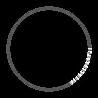
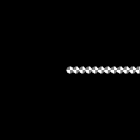
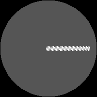
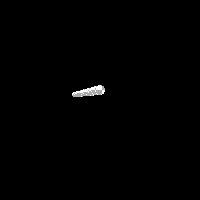

Numga is a geometric algebra library for the python ecosystem.

To jump straight into an example which is illustrative of the design motivation and capabilities of this library:

|                                       Elliptical                                       |                                    Euclidian                                           |
:--------------------------------------------------------------------------------------:|:--------------------------------------------------------------------------------------:
  |  
  |  

Here we have a rigid body physics engine with constraint solver, implemented in [57 lines](./numga/examples/physics/core.py) of numga (not counting comments, rendering and scene setup code).
Note that the exact same lines of code are responsible for all the above simulations; and they should work just the same in more exotic spaces too.

Not only can we implement very clean, generic, geometric, and coordinate free physics simulations via the power of geometric algebra;
by using the [JAX](https://github.com/google/jax) backend (torch backend also available), we can have all the nice things provided by geometric algebra, while generating optimizable compiled code, that will run on all compilation targets supported by JAX.


Overview
--------
Numga is primary designed to work with JAX, but it can be used as a pure numpy library as well. 
A torch backend is available too, and it is set up with the potential to generate code for other backends in the future.

The primary supported algebras are those with dimension under 6.
For these algebras, normalizations, logarithms and exponentials are provided by this library 'batteries included'. 

Algebras with dimensions > 10 will suffer substantial compilation overheads. 
The primary goal of this libray is to support modest dimensional algebras and their applications; although improvements to the support for higher dimensions are welcome.

numga strives to fuse ga-expressions as much as possible, into single optimized linear operators, in a symbolic manner.
This permits numga to deduce useful properties; for example, it 'knows' that the product of two quaternions returns a quaternion, not a full multivector.
In theory, a compiler like JAX might come to the same conclusion, but even if it did so consistently,
it would massively bloat our JAX compilation graphs, and JAX compilation times tend to be already a bottleneck.

Note this library is currently in alpha state. Anything about this library, including its fundamental design choices, are still up for reconsideration. 
That being said, it is pretty useful as is, and code written using the high level interface of this library today, is unlikely to change much in the future.


Terminology note
----------------
Geometric algebra is an active area of research, with quite some variety in, and sometimes conflicting terminology. Even basic terms like 'inner product', 'dual' and 'pseudovector' can mean substantially different things in different contexts. 
We attempt to make our library as terminology agnostic as possible; without being annoying and trying to come up with your own attempt at a more unifying terminology ourselves at every turn.
The least we can strive to do, is to be very explicit in our docstrings, as to what is meant where.

Operator overloading conventions follow those of [ganja.js](https://github.com/enkimute/ganja.js), insofar possible in python. That is, ganja >>> becomes >> in python; and we have no prefix ! operator in python.

This library strives to be agnostic towards the syntax favored by [bivector.net](https://bivector.net/) versus [projectivegeometricalgebra.org](https://projectivegeometricalgebra.org/)
We do provide all anti-space linear operators out of the box, but not all anti-norms and other nonlinear operators are currently implemented. 
Ideally the library should facilitate swapping out bivector.net conventions versus alternatives, perhaps through the use of elective mixin classes, but I have not yet figured out a design that I really like.


Design notes and future work
----------------------------
Computing a full product between all elements of the algebra is seldom required in GA applications, and as such numga lazily constructs all products operators. 
This helps with performance of medium and high dimensional algebras (say, dimension > 10), though for the more relevant low dimensional algebras, it really does not matter a whole lot. 
And it does add a lot of complexity to our OperatorFactory logic; so a greedy rather than lazy approach might be preferred in future versions. 

Type system
-----------
The objects encountered in geometric algebra do not readily map to the OOP typing paradigm. To take an example; a quaternion 'is-not', nor 'has-a' multivector; nor the other way around. 
A full multivector contains state a quaternion does not, yet a quaternion contains functionality a generic multivector does not.
In practice, that means you will not find a Quaternion type in this library. 
There is only the MultiVector type as far as the python type system is concerned; and how many components it has, what those components mean, is encoded in the subspace (gatype) attribute of the MultiVector class
It is this attribute that extends the MultiVector type, and allows it to invoke suitable geometric algebra operators; much like the dtype in a numpy array allows it to invoke the correct precompiled C code.

Using this approach, we can also implement multiple-dynamic-dispatch, which is very useful in a GA context, but isnt available in the python language.

For instance, we can dispatch functionality, based on arbitrarily complicated matching functions to the underlying subspaces:
```python
mv.decompose_invariant = SubspaceDispatch()
@mv.decompose_invariant.register(lambda s: s.inside.bivector() and s.squared().inside.scalar())
def bivector_decompose_simple(b: BiVector) -> Tuple[BiVector, BiVector]:
    return b, b.context.multivector.empty()
```
If compiled using JAX tracing, abstractions like these that do not touch any JAX arrays carry zero overhead; but even without compilation, the only code executed on repeated calls is akin to ```func = cache[id(s)]```; par for the course in a dynamic language like python.

gatype
------
Currently, all type information of a multivector is encoded into its subspace object.
In the future, it would make sense to generalize this into a gatype object,
which is able to encode not just the meaning of each basis blade, but also encodes constraints on the numerical values of the multivector.

For instance, all motors are elements of the even-grade subalgebra; but only normalized elements of the even-grade subalgebra are motors.
If our type system could differentiate the two, we could make much cleaner and safer interfaces.
Now, we have to choose between pre-emptively normalizing input motors, in algorithms that blow up without normalized inputs,
or hoping people will read and appreciate the docstring as a performance optimization.

Another place a more expressive gatype would be beneficial is in the implementation of the sandwich operator.
Sandwiching with an n-reflection is a grade-preserving operation; sandwiching with an element of the even-grade subalgebra in general is not.
The current sandwich operator assumes grade preservation, since itd just be too annoying to be explicitly casting away unwanted grades in your code all the time,
but with a more expressive gatype system, we could solve such things without any compromise.

Operators
---------
All linear GA operations are internally represented by an Operator object. 
For instance, a dual operator is a unary operator, a geometric product a binary operator, and a sandwich product a ternary operator; and so on. 
Whereby an n-ary operator maps n multivectors to a multivector.
In future version of this library, we might choose to represent multivectors themselves as nullary GA-operators. 
This might seem like the kind of dumb thing that only appeals to theoretical mathematicians, but it would result in quite some code reduction, and generalization in terms of how slicing, broadcasting, (partial) binding, and composition works, between operators and multivectors.

Execution
---------
One of the design goals is to provide a clean separation between 'symbolic' algebraic types, such as algebras, subspaces, and expressions,
and 'concrete' backend-specific numerical types, such as multivectors and multi-linear operators.

We provide different execution strategies for our concrete operator types. 
This is especially relevant in JAX, where we can choose between 'sparse' or 'dense' execution of operators. 
Dense execution results in much smaller compute graphs to compile, but for a typical ga-operator, a lot of multiplications with zero at runtime, 
On the other hand, unrolling linear operations over only their nonzero terms results in bigger compute graphs, but generally faster runtime performance.

This leads to a welcome choice between fast debug compilation, and slower release compilation.
These differences in compile times and runtimes can easily swing 10x either way; exactly how it pans out for you will heavily depend on your actual code, compilation target, batch sizes, and so on.
But numga makes it trivial to swap out these styles and experiment.

As an interesting case study [alphafold](https://github.com/deepmind/alphafold) uses a dense execution strategy for their quaternion product
([quat_multiply](https://github.com/deepmind/alphafold/blob/5cb2f8c480aa8314c02a93c6fbfc3f48f0ce8af0/alphafold/model/quat_affine.py#L153))
but a sparse execution strategy for their cross product
([vecs_cross_vecs](https://github.com/deepmind/alphafold/blob/5cb2f8c480aa8314c02a93c6fbfc3f48f0ce8af0/alphafold/model/r3.py#L265)).
Despite the fact that the overall degree of sparsity of both operators is quite similar.
It is unclear to me if these are deliberate choices; possibly the 4x4x4 quaternion product maps particularly well to the TPU, which can execute 4x4 matrix products as a single instruction. 

Performance aside, it is also interesting to observe how much it hurts the soul, looking at code like this, when you have become accustomed to geometric algebra... if there is anything missing in numga that prevents you from adoption in alphafold or some other library, please do raise an issue in this repo!
