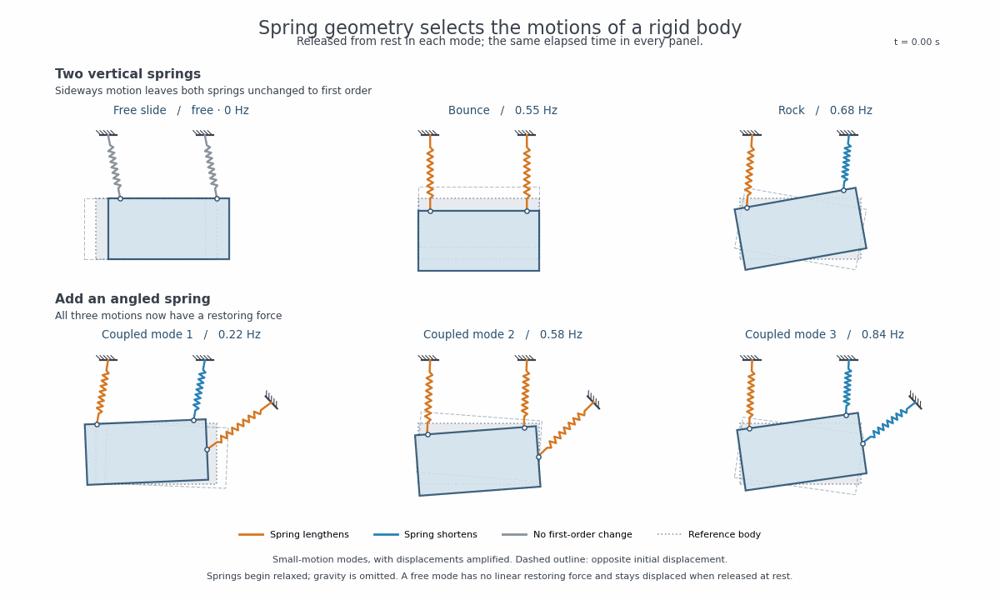
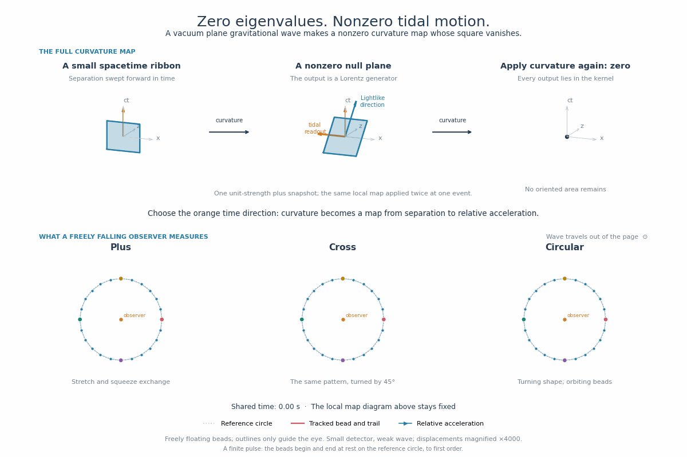

# numga

Geometric algebra and linear algebra in the same language.

A geometric expression can describe a value, a linear map, or a multilinear
form. Leave an input open to construct the map; compose it, sum it, solve with
it, or find its eigenvectors. Its matrix is a coefficient representation of
the geometry you wrote.

## From a point cloud to inertia

Each mass point contributes momentum under an open rigid motion. Sum those
contributions to get the body's inertia, then solve for its motion:

```python
from numga import NumpyContext
from numga.algebras import PGA3D

mv = NumpyContext(PGA3D).multivector
Bivector = PGA3D.gatype.bivector()

# Four unit masses, represented as homogeneous points.
points = mv.antivector([
    [0, 0, 0, 1],
    [1, 0, 0, 1],
    [0, 1, 0, 1],
    [0, 0, 1, 1],
])
momentum = mv.xy + 0.5 * mv.zw

inertia = (points & points.commutator(Bivector)).sum()
rate = inertia.solve(momentum)
kinetic_energy = (rate & momentum) * 0.5
```

`Bivector` is an open input. `points.commutator(Bivector)` therefore describes
each point's velocity as a function of rigid motion. The join `&` turns that
velocity into momentum; the sum produces one linear map.

The resulting map participates in geometric expressions too. Place the whole
body with a motor, including its inertia:

```python
motor = (mv.xy * 0.3 + mv.zw * 0.2).exp()
world_inertia = motor >> inertia(motor << Bivector)
world_rate = world_inertia.solve(motor >> momentum)
```

Ordinary multivectors have no open inputs; linear maps have one; bilinear forms
have two. Numga represents all of them as extensors. Rotations, shears,
projections, inertia and material response can be constructed and composed in
one library, with geometric types retained through the calculation.

## Examples

The [extensor cheatsheet](../extensor_cheatsheet.md) gives short constructions.
The [example index](examples/README.md) links the full tutorials and run commands.

| Example | Geometric construction |
| --- | --- |
| [Rotation estimation](examples/geometry/registration.py) | An open rotor sandwich becomes a quadratic alignment objective. |
| [Spring modes](examples/mechanics/stiffness.py) | Spring lines produce stiffness; stiffness and inertia produce vibration modes. |
| [Lens camera](examples/sketches/lens_camera.py) | Compose lenses and pull aperture quadrics through the optical system. |
| [Moving materials](examples/electromagnetism/constitutive/) | Build a material response, boost it, and solve for wave polarizations. |
| [Gravitational waves](examples/relativity/curvature/) | Construct curvature from spacetime bivectors and extract an observer's tidal map. |

| Spring modes | Gravitational waves |
| :---: | :---: |
|  |  |

## Run it

This directory contains the ongoing rewrite, with a separate API from the
legacy package at the repository root. Run these commands from `rewrite/`:

```sh
python -m pip install -e ".[linalg,test]" matplotlib pillow
PYTHONPATH=src:. python -m examples.geometry.registration
python -m pytest
```

NumPy is the default numerical backend. Install `.[jax]` for the optional JAX
backend. Arrays batch geometric values without changing their types; maps
support composition, inverse, solves, eigendecomposition, SVD and Cholesky.

For API usage beyond the tutorials, see the
[end-to-end tests](tests/test_end_to_end.py) and
[linear algebra tests](tests/test_unary_extensions.py).
