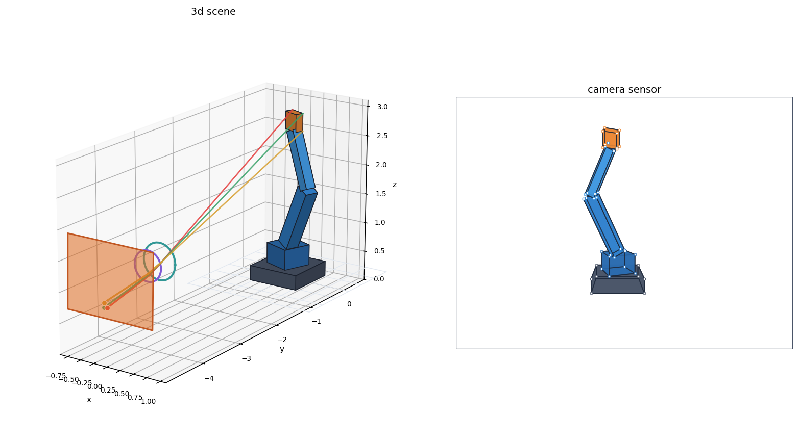
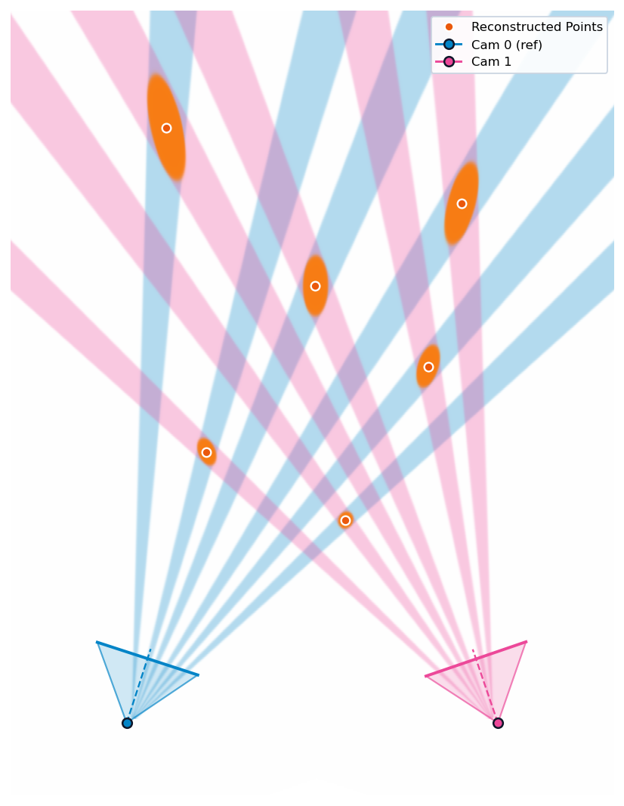
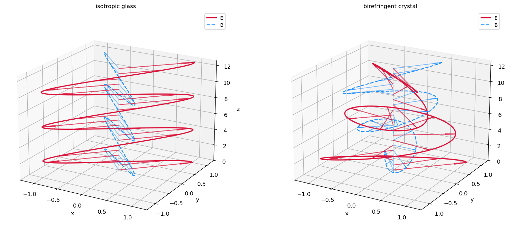

# Definition

In mathematical terms, an extensor is a multi-linear map from multivectors to a multivector.

In programming terms, extensors allow one to leave open arguments to an expression, and bind them at a later time.

When doing mathematics on the blackboard, one often switches between expressions involving a specific vector, or expressions over the entire space of vectors. Extensor syntax brings that same flexibility to geometric algebra in code, combining expressivity with efficiency of the underlying code.

# Motivation

Geometric relationships deserve to be first-class objects alongside the objects they relate. Inertia, stiffness, and material responses are maps that we need to construct, combine, transform, and solve with. Extensors make those relationships part of the geometric algebra library, expressed through the same operations as the geometry that defines them.

Another consequence of extensors is to reconcile geometric algebra with conventional linear algebra. While geometric algebra traditionally focuses on outermorphisms and rotor sandwiches, practical engineering relies on the full spectrum of linear maps: non-orthogonal transformations, polarities, and derivations. Extensors bridge this divide by subsuming matrices into the algebra itself: any linear map between blade subspaces becomes a typed, coordinate-free object. Solvers, spectral decompositions, and least-squares optimizations can be performed directly on geometric relationships, returning geometrically typed results.


# Examples

This document will go over some examples demonstrating the practical utility of extensors and the particulars of their implementation in numga. As a convention, Capitalized names represent multivector spaces, and lower case names concrete multivectors. For instance, `v ^ V` represents the wedge product of a specific vector with the space of all vectors; the result is an extensor of bivector output type, that is unary (having one open argument).

### Index
1. [**Computer Graphics & Optics (PGA3D)**](#1-scenegraph-forward-kinematics--camera-optics-pga3d): Collapsing affine scales, joint motors, compound lenses, and sensor projection into a single evaluated extensor.
2. [**Mechanics & Vibrations (PGA2D)**](#2-rigid-body-normal-modes--vibration-pga2d): Additive stiffness and inertia extensors without coordinate origins, generalized eigensolves on energy bilinear forms.
3. [**Multi-View Vision & Camera Alignment (PGA2D)**](#3-multi-view-scene-reconstruction--camera-alignment-pga2d): Lifting 1D pixels into directional quadric cones, additive multi-view fusion, closed-form triangulation, and Lie algebra pose Jacobians.
4. [**Electromagnetism & Spacetime Physics (STA)**](#4-spacetime-constitutive-relations-dispersion--relativistic-fresnel-drag-sta): Observer decompositions, lifting 3D material quadrics to 6D spacetime extensors, and detecting wave dispersion and polarizations via SVD.

---

## 1. Scenegraph, Forward Kinematics & Camera Optics (PGA3D)

**Notebook**: [`examples/geometry/scenegraph/scenegraph.ipynb`](examples/geometry/scenegraph/scenegraph.ipynb)



#### Construction
```python
# Non-uniform scale, joint motors, compound optics, and viewport collapse into one extensor:
body = pose >> make_anisotropic_scale(sx, sy, sz)                     # [] Point <- Point
camera = to_sensor(rear_lens(front_lens(ray_constructor)))            # [] Point <- Point
local_to_pixel = viewport(camera(camera_pose << body))                # [5] Point <- Point

# Evaluates directly as broadcasted 4x4 matrix multiplication over geometry:
pixels = local_to_pixel[:, None](unit_box[None, :])                   # [5, 8] Point
```

#### Key Takeaways
* **Full Pipeline Collapse**: Non-uniform scaling (affine), articulated joint motors (rigid), compound lenses (refractive), and sensor projection (perspective) compose into a single batched extensor (`Point <- Point`) *before* touching geometry.
* **Matrix-Equivalent Execution**: Extensors compile down to broadcasted 4x4 fused-multiple-adds under the hood, matching classical graphics pipeline performance while staying entirely within the GA-typed algebra.

---

## 2. Rigid-Body Normal Modes & Vibration (PGA2D)

**Notebook**: [`examples/mechanics/modes/modes.ipynb`](examples/mechanics/modes/modes.ipynb)


#### Construction
```python
# Measure spring stretch from an open twist, assemble stiffness and inertia, eigensolve:
extension = Twist & lines                                              # [n_springs] Scalar <- Twist
stiffness = (lines * extension * spring_constants).sum()               # [] Wrench <- Twist
inertia = (mass_points & mass_points.commutator(Twist) * masses).sum()  # [] Wrench <- Twist

# Symmetric bilinear energy forms dispatch to generalized Hermitian eigensolve:
values, modes = (Twist & stiffness).eigh(Twist & inertia)              # values: [3] Scalar, modes: [3] Twist
frequencies = values.clip(0, np.inf).square_root() / (2 * np.pi)       # [3] Scalar (Hz)
```

#### Key Takeaways
* **Additive Physical Responses**: Springs are rank-1 dyads (`Wrench <- Twist`) and mass points are momentum lines (`Wrench <- Twist`). Summing individual extensors synthesizes total stiffness and inertia without selecting coordinate origins or applying Steiner's parallel-axis shifts.
* **Energy Bilinear Forms & Eigensolve**: Contracting with open twists yields symmetric bilinear forms (`Scalar <- (Twist, Twist)`), allowing a direct generalized eigensolve `pe_form.eigh(ke_form)` without inverting inertia or forming asymmetric coordinate matrices $M^{-1}K$.

---

## 3. Multi-View Scene Reconstruction & Camera Alignment (PGA2D)

**Notebook**: [`examples/geometry/multiview/multiview_reconstruction.ipynb`](examples/geometry/multiview/multiview_reconstruction.ipynb)



#### Construction
```python
# Pull 1D pixels back into 2D sight cones, fuse across cameras, triangulate via polar duality:
cones = pullback(sensor_discs(projection))                             # [n_pts, n_cams] Plane <- Point
splats = (poses >> cones(poses << Point)).sum(axis=-1)                 # [n_pts] Plane <- Point
points = splats.solve(w).normalized()                                  # [n_pts] Point

# Differentiate alignment error via Lie algebra bivector commutators for camera pose updates:
j = -cones(Twist.commutator(poses << points))                          # [n_pts, n_cams] Line <- Twist
step = (j.T(j)).sum().solve(-(j.T(res)).sum())                         # [n_cams] Twist
```

#### Key Takeaways
* **Lifting Precision into Sight Cones**: Pulling back rank-1 sensor precision through camera projection lifts 1D pixel measurements into perspective quadric cones whose uncertainty naturally widens with depth.
* **Additive Fusion & Closed-Form Triangulation**: Multi-view constraints combine by direct addition (`splats = world_cones.sum()`), and reconstructed point positions are extracted in closed form as poles of infinity (`splats.solve(w)`) without ray-intersection heuristics.
* **Lie Algebra Sensitivities**: Commutators with open twists (`Twist.commutator(...)`) yield analytic pose Jacobians, and inverting Gauss-Newton curvature directly yields typed pose covariance extensors (`Twist <- Twist`).

---

## 4. Spacetime Constitutive Relations, Dispersion & Relativistic Fresnel Drag (STA)

**Notebook**: [`examples/electromagnetism/constitutive/constitutive.ipynb`](examples/electromagnetism/constitutive/constitutive.ipynb)



#### Construction
```python
# Split 6D bivectors via observer, lift 3D material quadric, and boost via Lorentz sandwich:
electric = Bivector.commutator(t).wedge(t)                             # [] Bivector <- Bivector
crystal = permittivity(Bivector.commutator(t)).wedge(t) + magnetic / mu
moving_crystal = boost >> crystal(boost << Bivector)                   # [n_betas] Bivector <- Bivector

# Detect physical plane waves where Maxwell wave map drops rank:
wave = k.commutator(moving_crystal(k.wedge(Spatial)))                  # [n_speeds] Vector <- Spatial
v_phase = speeds[wave.svdvals()[..., -1].argmin(axis=0)]
```

#### Key Takeaways
* **Observer Decomposition & Quadric Lifting**: An observer's timelike 4-velocity $t$ decomposes 6D field bivectors into 3D electric and magnetic vectors. Spatial material relations lift into 6D bivector extensors without coordinates.
* **Dispersion & Polarizations via SVD**: Maxwell's equations in media compile into a single linear map $W_k$; physical propagating phase speeds and transverse polarizations emerge directly from SVD nullspaces.
